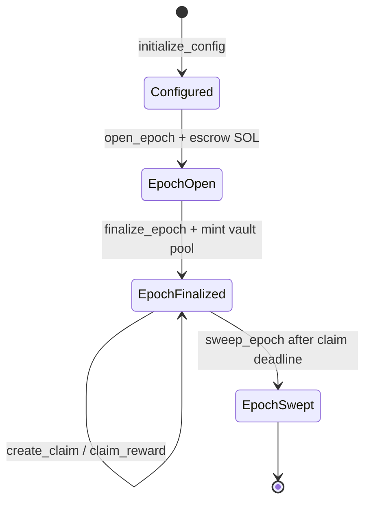

# PCN Permissioned Bandwidth Rewards Program Spec

## Goal

Build an Anchor program that mints PCN rewards for measured bandwidth contributions using Zinc's scarcity/support curve shape, adapted to a permissioned oracle workflow.

The v1 program is intentionally centralized around a trusted oracle:

- The program owns a 9-decimal SPL Token mint.
- A single configured oracle opens epochs, finalizes epoch reward pools, and creates per-user claim records from off-chain bandwidth measurements.
- An admin can update configuration, curve parameters, oracle address, and claim-window length.
- SOL support budgets cap token emissions and are escrowed per epoch.
- Users claim rewards from per-epoch token vaults through deterministic claim PDAs.
- Consumed SOL remains locked in a program reserve in v1.
- Unused SOL is refunded at epoch finalization.
- Unclaimed minted tokens can be swept to a token reserve after the claim window expires.

The program must use standard SPL Token via `anchor-spl = "1.0.2"`. Do not use Token-2022 in v1.

## Core Constants

```rust
pub const TOKEN_DECIMALS: u8 = 9;
pub const TOKEN_BASE_UNITS: u64 = 1_000_000_000;
pub const QUALITY_PPM_SCALE: u64 = 1_000_000;
pub const CONFIG_SEED: &[u8] = b"config";
pub const MINT_AUTHORITY_SEED: &[u8] = b"mint_authority";
pub const SOL_RESERVE_SEED: &[u8] = b"sol_reserve";
pub const TOKEN_RESERVE_SEED: &[u8] = b"token_reserve";
pub const EPOCH_SEED: &[u8] = b"epoch";
pub const EPOCH_VAULT_SEED: &[u8] = b"epoch_vault";
pub const CLAIM_SEED: &[u8] = b"claim";
```

Quality factors are expressed in parts per million:

- `1_000_000` means 1.0x quality.
- `500_000` means 0.5x quality.
- `0` is valid only if the oracle intends the user to receive zero reward weight.
- Values above `1_000_000` must be rejected.

Reward weight is:

```text
reward_weight = floor(bandwidth_units * quality_factor_ppm / QUALITY_PPM_SCALE)
```

Use checked integer arithmetic everywhere. Use `u128` for intermediate multiplication and division. Reject overflow rather than saturating.

## Cargo Dependency

Update `programs/pcn-program/Cargo.toml`:

```toml
[dependencies]
anchor-lang = "1.0.2"
anchor-spl = "1.0.2"
```

Use `anchor_spl::token::{Mint, Token, TokenAccount, MintTo, Transfer}` and standard SPL Token account constraints.

## State

### Config PDA

PDA seeds:

```text
[b"config"]
```

Fields:

```rust
#[account]
pub struct Config {
    pub admin: Pubkey,
    pub oracle: Pubkey,
    pub reward_mint: Pubkey,
    pub mint_authority_bump: u8,
    pub config_bump: u8,
    pub sol_reserve: Pubkey,
    pub sol_reserve_bump: u8,
    pub token_reserve_vault: Pubkey,
    pub token_reserve_bump: u8,
    pub lifetime_curve_minted_amount: u64,
    pub claim_window_slots: u64,
    pub curve: CurveParams,
}
```

### Curve Params

```rust
#[derive(AnchorSerialize, AnchorDeserialize, Clone, Copy, Debug, PartialEq, Eq)]
pub struct CurveParams {
    pub max_epoch_mint: u64,
    pub saturation_units: u64,
    pub history_minted: u64,
    pub target_support_lamports_per_token: u64,
    pub max_supply: u64,
}
```

Validation:

- `max_epoch_mint > 0`
- `saturation_units > 0`
- `history_minted > 0`
- `target_support_lamports_per_token > 0`
- `max_supply > 0`
- On update, `max_supply >= config.lifetime_curve_minted_amount`

`target_support_lamports_per_token` is denominated in lamports per 1 whole 9-decimal token, not per base unit.

### Epoch PDA

PDA seeds:

```text
[b"epoch", epoch_id.to_le_bytes()]
```

Fields:

```rust
#[account]
pub struct Epoch {
    pub epoch_id: u64,
    pub status: EpochStatus,
    pub start_slot: u64,
    pub end_slot: u64,
    pub support_budget_lamports: u64,
    pub consumed_support_lamports: u64,
    pub total_reward_weight: u64,
    pub reward_pool_amount: u64,
    pub allocated_amount: u64,
    pub claimed_amount: u64,
    pub claim_deadline_slot: u64,
    pub epoch_token_vault: Pubkey,
    pub epoch_vault_bump: u8,
    pub bump: u8,
}
```

```rust
#[derive(AnchorSerialize, AnchorDeserialize, Clone, Copy, Debug, PartialEq, Eq)]
pub enum EpochStatus {
    Open,
    Finalized,
    Swept,
}
```

Status rules:

- `Open`: measurements are still being gathered off-chain; no claims can be created.
- `Finalized`: reward pool has been minted to the epoch vault; claims can be created until the deadline and users can claim.
- `Swept`: no more claims or user transfers are allowed.

### Claim PDA

PDA seeds:

```text
[b"claim", epoch_id.to_le_bytes(), user.key().as_ref()]
```

Fields:

```rust
#[account]
pub struct Claim {
    pub epoch: Pubkey,
    pub epoch_id: u64,
    pub user: Pubkey,
    pub bandwidth_units: u64,
    pub quality_factor_ppm: u64,
    pub reward_weight: u64,
    pub reward_amount: u64,
    pub claimed: bool,
    pub bump: u8,
}
```

There is exactly one claim account per `(epoch_id, user)`. Duplicate initialization must fail through Anchor's `init` constraint and/or an explicit duplicate error if implemented manually.

## Accounts And Authorities

### Program-Owned Reward Mint

The reward mint is a standard SPL Token mint with:

- `decimals = 9`
- `mint_authority = mint_authority_pda`
- `freeze_authority = None` unless implementation has a specific reason to freeze; v1 should prefer no freeze authority.

Mint authority PDA seeds:

```text
[b"mint_authority"]
```

### SOL Reserve PDA

PDA seeds:

```text
[b"sol_reserve"]
```

The SOL reserve is a system-owned PDA account controlled by the program. It stores consumed support lamports. V1 has no withdrawal instruction.

### Token Reserve Vault

PDA seeds:

```text
[b"token_reserve"]
```

This is an SPL token account:

- `mint = reward_mint`
- `authority = mint_authority_pda` or another deterministic program authority

Swept unclaimed tokens are transferred here. V1 has no reserve-withdrawal instruction.

### Epoch Token Vault

PDA seeds:

```text
[b"epoch_vault", epoch_id.to_le_bytes()]
```

This is an SPL token account:

- `mint = reward_mint`
- `authority = mint_authority_pda`

`finalize_epoch` mints the epoch reward pool into this vault. `claim_reward` transfers from this vault to the user's token account. `sweep_epoch` transfers leftovers to the token reserve vault.

## Curve Formula

The reward pool is capped by scarcity, SOL support, and remaining supply.

Inputs:

- `total_reward_weight`: trusted oracle report for the finalized epoch.
- `support_budget_lamports`: SOL escrow budget attached to the epoch.
- `lifetime_curve_minted_amount`: total amount minted by previous finalized epochs.
- `curve.max_epoch_mint`
- `curve.saturation_units`
- `curve.history_minted`
- `curve.target_support_lamports_per_token`
- `curve.max_supply`

### Scarcity Component

```text
scarcity =
  max_epoch_mint
  * (1 - exp(-total_reward_weight / saturation_units))
  / (1 + lifetime_curve_minted_amount / history_minted)
```

Implementation requirement:

- Mirror Zinc's existing curve behavior as closely as practical.
- Keep all observable rounding behavior covered by unit tests.
- If the on-chain implementation cannot use floating point, implement a deterministic fixed-point approximation and document the precision.
- The rounded scarcity result is `round(scarcity)` in base units.

### Support Component

The SOL budget caps emissions by target support per whole token:

```text
support_cap =
  floor(support_budget_lamports * TOKEN_BASE_UNITS / target_support_lamports_per_token)
```

This returns token base units.

### Remaining Supply Component

```text
remaining_curve_supply =
  max_supply - lifetime_curve_minted_amount
```

Reject finalization if the subtraction would underflow. If remaining supply is zero, finalization must fail with `MaxSupplyExhausted`.

### Reward Pool

```text
reward_pool =
  min(round(scarcity), support_cap, remaining_curve_supply)
```

If `reward_pool == 0`, finalization must fail. This catches zero support, zero total weight, exhausted supply, and curve configurations that result in no mintable output.

### Consumed SOL

The consumed support is rounded up so the minted token pool is fully backed by the configured support target:

```text
consumed_support_lamports =
  ceil(reward_pool * target_support_lamports_per_token / TOKEN_BASE_UNITS)
```

`consumed_support_lamports` must be `<= support_budget_lamports`. Any excess SOL is refunded to the epoch funder during `finalize_epoch`.

### Claim Amounts

For a user claim:

```text
reward_amount =
  floor(epoch.reward_pool_amount * claim.reward_weight / epoch.total_reward_weight)
```

Rules:

- Reject claim creation if `epoch.total_reward_weight == 0`.
- Reject quality factors above `QUALITY_PPM_SCALE`.
- Reject if `epoch.allocated_amount + reward_amount > epoch.reward_pool_amount`.
- Allow zero-amount claims only if the product and rounding truly compute zero. Such claims can be created but claiming them should be a no-op or rejected consistently; prefer no-op claim that marks `claimed = true`.

Rounding dust remains in the epoch vault until `sweep_epoch`.

## Instructions

### initialize_config

Initializes config, mint, reserve accounts, and the token reserve vault.

Arguments:

```rust
pub struct InitializeConfigArgs {
    pub admin: Pubkey,
    pub oracle: Pubkey,
    pub claim_window_slots: u64,
    pub curve: CurveParams,
}
```

Required accounts:

- `payer`: signer, funds account creation.
- `config`: PDA `[b"config"]`, initialized.
- `reward_mint`: initialized SPL mint with 9 decimals.
- `mint_authority`: PDA `[b"mint_authority"]`.
- `sol_reserve`: PDA `[b"sol_reserve"]`, system account.
- `token_reserve_vault`: initialized token account PDA `[b"token_reserve"]`.
- `system_program`
- `token_program`
- `rent`

Validation:

- `admin != Pubkey::default()`
- `oracle != Pubkey::default()`
- `claim_window_slots > 0`
- curve params pass validation
- reward mint decimals are exactly `TOKEN_DECIMALS`
- reward mint authority is the mint authority PDA

Effects:

- Writes config fields.
- Sets `lifetime_curve_minted_amount = 0`.
- Stores all PDA bumps.

### update_config

Admin-only update for oracle, curve params, and claim window.

Arguments:

```rust
pub struct UpdateConfigArgs {
    pub oracle: Option<Pubkey>,
    pub claim_window_slots: Option<u64>,
    pub curve: Option<CurveParams>,
}
```

Required accounts:

- `admin`: signer, must equal `config.admin`.
- `config`: mutable config PDA.

Validation:

- Reject non-admin.
- If oracle is provided, reject default pubkey.
- If claim window is provided, require `> 0`.
- If curve is provided, validate params and require `curve.max_supply >= config.lifetime_curve_minted_amount`.

Effects:

- Applies provided fields atomically.

### open_epoch

Oracle opens an epoch and escrows SOL support.

Arguments:

```rust
pub struct OpenEpochArgs {
    pub epoch_id: u64,
    pub start_slot: u64,
    pub end_slot: u64,
    pub support_budget_lamports: u64,
}
```

Required accounts:

- `oracle`: signer, must equal `config.oracle`.
- `funder`: signer, pays support budget and account rents.
- `config`: config PDA.
- `epoch`: PDA `[b"epoch", epoch_id]`, initialized.
- `epoch_token_vault`: token account PDA `[b"epoch_vault", epoch_id]`, initialized.
- `mint_authority`: PDA `[b"mint_authority"]`.
- `reward_mint`
- `system_program`
- `token_program`
- `rent`

Validation:

- Reject non-oracle.
- `start_slot < end_slot`.
- `support_budget_lamports > 0`.
- Epoch account must not already exist.
- Epoch vault mint and authority must match config.

Effects:

- Transfers `support_budget_lamports` from `funder` into the epoch PDA or another deterministic epoch escrow account.
- Creates an `Open` epoch with zeroed reward, allocation, and claim counters.
- Stores the support budget and slot window.

### finalize_epoch

Oracle closes measurement intake, computes the epoch pool, mints rewards, locks consumed SOL, and refunds unused support.

Arguments:

```rust
pub struct FinalizeEpochArgs {
    pub total_reward_weight: u64,
}
```

Required accounts:

- `oracle`: signer, must equal `config.oracle`.
- `refund_target`: mutable system account receiving unused support.
- `config`: mutable config PDA.
- `epoch`: mutable epoch PDA.
- `epoch_token_vault`: mutable epoch token vault.
- `reward_mint`: mutable SPL mint.
- `mint_authority`: PDA `[b"mint_authority"]`.
- `sol_reserve`: mutable SOL reserve PDA.
- `token_program`
- `system_program`

Validation:

- Reject non-oracle.
- Epoch status must be `Open`.
- Current slot must be greater than or equal to `epoch.end_slot`.
- `total_reward_weight > 0`.
- Curve params are still valid.
- Reward pool must be greater than zero.
- Reward pool must not exceed remaining supply.
- Consumed support must not exceed support budget.

Effects:

- Computes scarcity cap, support cap, remaining supply, reward pool, and consumed support.
- Moves consumed support lamports from epoch escrow into `sol_reserve`.
- Refunds `support_budget_lamports - consumed_support_lamports` to `refund_target`.
- Mints `reward_pool_amount` to `epoch_token_vault` using mint authority PDA.
- Increments `config.lifetime_curve_minted_amount` by `reward_pool_amount`.
- Stores:
  - `epoch.status = Finalized`
  - `epoch.total_reward_weight`
  - `epoch.reward_pool_amount`
  - `epoch.consumed_support_lamports`
  - `epoch.claim_deadline_slot = current_slot + config.claim_window_slots`

### create_claim

Oracle creates a per-user claim from a finalized measurement report.

Arguments:

```rust
pub struct CreateClaimArgs {
    pub epoch_id: u64,
    pub user: Pubkey,
    pub bandwidth_units: u64,
    pub quality_factor_ppm: u64,
}
```

Required accounts:

- `oracle`: signer, must equal `config.oracle`.
- `payer`: signer, funds claim account rent.
- `config`: config PDA.
- `epoch`: mutable epoch PDA.
- `claim`: PDA `[b"claim", epoch_id, user]`, initialized.
- `system_program`

Validation:

- Reject non-oracle.
- Epoch status must be `Finalized`.
- Current slot must be less than or equal to `epoch.claim_deadline_slot`.
- `quality_factor_ppm <= QUALITY_PPM_SCALE`.
- The claim PDA must not already exist.
- Computed `reward_weight` must match formula.
- `epoch.total_reward_weight > 0`.
- `epoch.allocated_amount + reward_amount <= epoch.reward_pool_amount`.

Effects:

- Stores claim details and computed reward amount.
- Increments `epoch.allocated_amount` by `reward_amount`.

### claim_reward

User claims a finalized reward.

Arguments:

```rust
pub struct ClaimRewardArgs {
    pub epoch_id: u64,
}
```

Required accounts:

- `user`: signer, must equal `claim.user`.
- `config`: config PDA.
- `epoch`: mutable epoch PDA.
- `claim`: mutable claim PDA.
- `epoch_token_vault`: mutable epoch vault.
- `user_token_account`: mutable SPL token account, `mint = config.reward_mint`, owned by `user`.
- `mint_authority`: PDA `[b"mint_authority"]`.
- `token_program`

Validation:

- Claim must belong to the epoch.
- Epoch status must be `Finalized`.
- Claim must not already be claimed.
- User signer must equal `claim.user`.
- Token account mint must equal `config.reward_mint`.
- Token account owner must equal `user`.
- `epoch.claimed_amount + claim.reward_amount <= epoch.reward_pool_amount`.
- Epoch vault balance must be at least `claim.reward_amount`.

Effects:

- Transfers `claim.reward_amount` from epoch vault to user token account.
- Sets `claim.claimed = true`.
- Increments `epoch.claimed_amount` by `claim.reward_amount`.

### sweep_epoch

Oracle sweeps leftover tokens after the claim window.

Arguments:

```rust
pub struct SweepEpochArgs {
    pub epoch_id: u64,
}
```

Required accounts:

- `oracle`: signer, must equal `config.oracle`.
- `config`: config PDA.
- `epoch`: mutable epoch PDA.
- `epoch_token_vault`: mutable epoch vault.
- `token_reserve_vault`: mutable token reserve vault.
- `mint_authority`: PDA `[b"mint_authority"]`.
- `token_program`

Validation:

- Reject non-oracle.
- Epoch status must be `Finalized`.
- Current slot must be greater than `epoch.claim_deadline_slot`.
- Reserve vault must equal `config.token_reserve_vault`.
- Epoch vault and reserve vault must use `config.reward_mint`.

Effects:

- Transfers entire remaining epoch vault balance to token reserve vault.
- Sets `epoch.status = Swept`.

No v1 instruction withdraws consumed SOL from `sol_reserve` or swept tokens from `token_reserve_vault`.

## State Machine



## Error Cases

Recommended custom errors:

```rust
#[error_code]
pub enum PcnError {
    #[msg("Only the configured admin may perform this action")]
    UnauthorizedAdmin,
    #[msg("Only the configured oracle may perform this action")]
    UnauthorizedOracle,
    #[msg("Invalid curve parameters")]
    InvalidCurveParams,
    #[msg("Invalid claim window")]
    InvalidClaimWindow,
    #[msg("Invalid epoch slot window")]
    InvalidEpochWindow,
    #[msg("Invalid support budget")]
    InvalidSupportBudget,
    #[msg("Epoch is not open")]
    EpochNotOpen,
    #[msg("Epoch is not finalized")]
    EpochNotFinalized,
    #[msg("Epoch claim deadline has passed")]
    ClaimDeadlinePassed,
    #[msg("Epoch claim deadline has not passed")]
    ClaimWindowStillOpen,
    #[msg("Total reward weight must be greater than zero")]
    ZeroTotalRewardWeight,
    #[msg("Quality factor exceeds 1.0x")]
    InvalidQualityFactor,
    #[msg("Reward pool is zero")]
    ZeroRewardPool,
    #[msg("Maximum curve supply is exhausted")]
    MaxSupplyExhausted,
    #[msg("Claim allocation exceeds epoch reward pool")]
    ClaimOverAllocation,
    #[msg("Claim already redeemed")]
    ClaimAlreadyRedeemed,
    #[msg("Claim account does not match epoch or user")]
    InvalidClaimAccount,
    #[msg("Reward mint or token account does not match config")]
    InvalidTokenAccount,
    #[msg("Arithmetic overflow or underflow")]
    MathOverflow,
}
```

## Security And Accounting Invariants

- Only the configured admin can update config.
- Only the configured oracle can open epochs, finalize epochs, create claims, and sweep epochs.
- The program mint authority is a PDA, never a user keypair.
- `config.lifetime_curve_minted_amount` equals the sum of all finalized `epoch.reward_pool_amount` values.
- `config.lifetime_curve_minted_amount <= config.curve.max_supply`.
- `epoch.allocated_amount <= epoch.reward_pool_amount`.
- `epoch.claimed_amount <= epoch.allocated_amount`.
- Token transfers from epoch vault never exceed the vault balance.
- Unused SOL is refunded during finalization.
- Consumed SOL remains in `sol_reserve` and has no v1 withdrawal path.
- Swept tokens land in `token_reserve_vault`.
- Finalized epochs are immutable except for claim allocation, claimed counters, and final sweep status.

## Test Plan

### Unit Tests

Add pure Rust tests for math helpers:

- Scarcity result increases with `total_reward_weight`.
- Scarcity approaches `max_epoch_mint` as weight grows when lifetime minted is zero.
- Scarcity is reduced as `lifetime_curve_minted_amount / history_minted` grows.
- Support cap computes `support_budget_lamports * TOKEN_BASE_UNITS / target_support_lamports_per_token`.
- Reward pool uses the minimum of rounded scarcity, support cap, and remaining supply.
- Consumed support uses ceiling division.
- Reward weight uses `bandwidth_units * quality_factor_ppm / QUALITY_PPM_SCALE`.
- Per-claim reward allocation uses floor division and leaves rounding dust.
- Overflow paths return errors.

These tests should mirror the relevant Zinc curve behavior using PCN reward-weight inputs.

### LitesVM Integration Tests

Happy path:

1. Initialize config, mint authority PDA, SOL reserve, reward mint, and token reserve vault.
2. Open epoch with a funded SOL support budget.
3. Advance slots beyond `end_slot`.
4. Finalize epoch with nonzero `total_reward_weight`.
5. Create two claims with different bandwidth and quality values.
6. Claim both rewards into user token accounts.
7. Advance slots beyond the claim deadline.
8. Sweep remaining dust to token reserve.

Authority tests:

- Non-admin cannot call `update_config`.
- Non-oracle cannot call `open_epoch`.
- Non-oracle cannot call `finalize_epoch`.
- Non-oracle cannot call `create_claim`.
- Non-oracle cannot call `sweep_epoch`.
- User cannot claim another user's claim.

Validation tests:

- Initialize rejects invalid curve divisors.
- Update rejects `max_supply` below already minted.
- Open epoch rejects zero support.
- Open epoch rejects `start_slot >= end_slot`.
- Finalize rejects before `end_slot`.
- Finalize rejects zero total weight.
- Finalize rejects max supply exhaustion.
- Create claim rejects quality above `1_000_000`.
- Create claim rejects duplicate claim PDA.
- Create claim rejects claim after deadline.
- Create claim rejects over-allocation.
- Claim rejects duplicate redemption.
- Sweep rejects before deadline.

Accounting tests:

- Lifetime minted increments exactly by the epoch reward pool.
- Epoch vault receives exactly `reward_pool_amount` on finalization.
- Claim amounts never exceed epoch vault balance.
- `allocated_amount` equals the sum of created claim amounts.
- `claimed_amount` equals the sum of redeemed claim amounts.
- Unused SOL is refunded to the refund target.
- Consumed SOL moves to and stays in the SOL reserve.
- Swept dust lands in the token reserve vault.

## Acceptance Criteria

- `plan.md` contains this complete program spec.
- `programs/pcn-program/Cargo.toml` includes `anchor-spl = "1.0.2"` when implementation starts.
- Program uses standard SPL Token accounts and mint instructions.
- All accounts use deterministic PDA seeds listed above.
- All curve and allocation math is deterministic and covered by tests.
- Admin/oracle authorization boundaries are tested.
- SOL and token accounting invariants are tested.
- Build and test commands pass:

```sh
cargo fmt
cargo test
anchor test
```

Run `anchor test` only when the local Anchor CLI/toolchain is available.

## Assumptions

- Oracle reports are trusted for measurement truth; v1 has no dispute window.
- Finalized epochs are immutable; corrections happen through a later adjustment epoch.
- All curve emissions go to users.
- Zinc's admin, Stockpile, Bonanza, and Wildcat splits are intentionally not ported.
- The sibling Zinc repository is read-only reference material.
- Implementation work happens only in this `pcn-program` repository.
